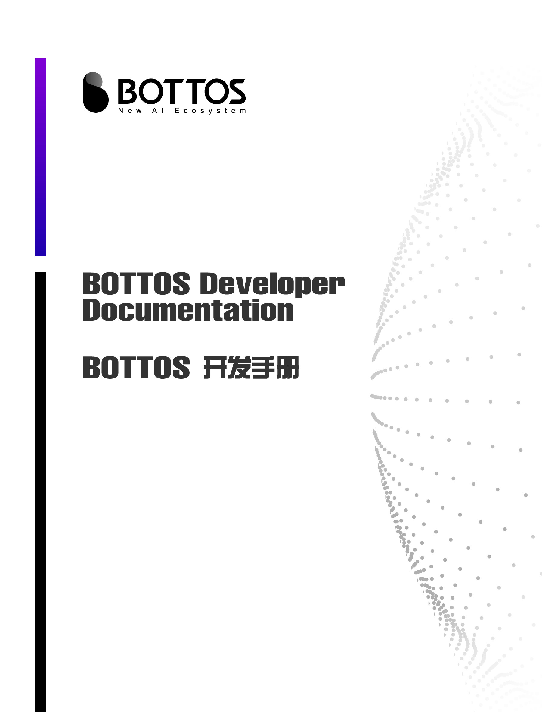
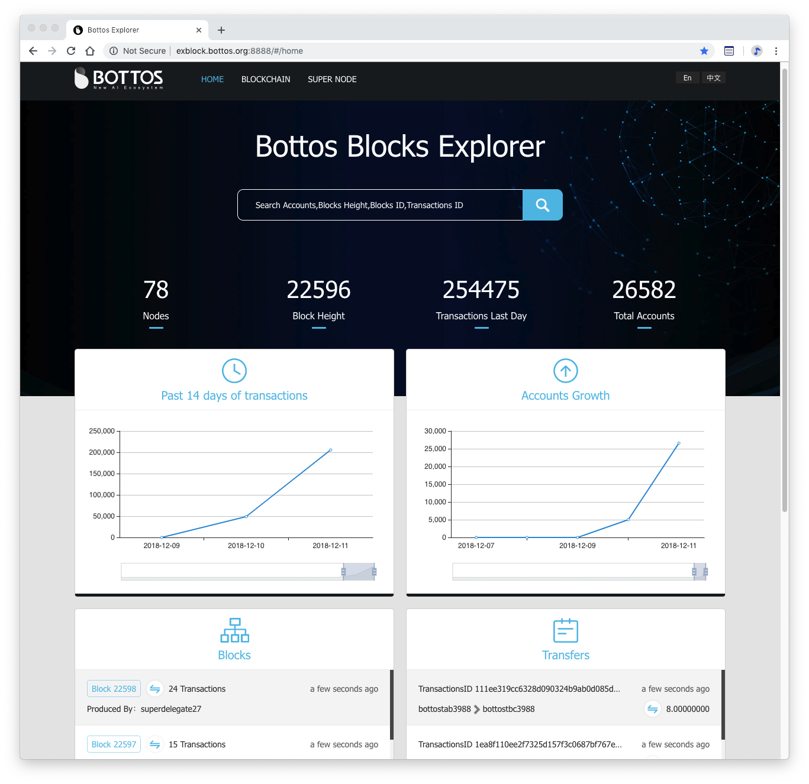

<div style="page-break-after: always;"></div>

<!-- TOC -->

- [1. Bottos Introduction](#1-bottos-introduction)
    - [1.1. Project Brief](#11-project-brief)
    - [1.2. System Architecture](#12-system-architecture)
    - [1.3. Network Structure](#13-network-structure)
- [2. 入门体验](#2-入门体验)
    - [2.1. Browser Bottos Chain](#21-browser-bottos-chain)
        - [2.1.1. Bottos Chain Overview](#211-bottos-chain-overview)
        - [2.1.2. Activities on Bottos Chain](#212-activities-on-bottos-chain)
        - [2.1.3. Locations of Super Nodes](#213-locations-of-super-nodes)
    - [2.2. Run Bottos Chain on Local Machine](#22-run-bottos-chain-on-local-machine)
    - [2.3. 准备Bottos可执行版本](#23-准备bottos可执行版本)
    - [2.4. 准备运行环境](#24-准备运行环境)
        - [2.4.1. 启动本地单节点环境](#241-启动本地单节点环境)
        - [2.4.2. 加入已存在的测试网络](#242-加入已存在的测试网络)
    - [2.5. 体验基本操作](#25-体验基本操作)
        - [2.5.1. 创建钱包](#251-创建钱包)
        - [2.5.2. 创建account](#252-创建account)
        - [2.5.3. 体验转账](#253-体验转账)
- [3. 操作进阶](#3-操作进阶)
    - [3.1. 质押](#31-质押)
    - [3.2. 赎回](#32-赎回)
    - [3.3. 投票资源](#33-投票资源)
    - [3.4. 空间资源](#34-空间资源)
    - [3.5. 时间资源](#35-时间资源)
- [4. 开发指引](#4-开发指引)
    - [4.1. 环境搭建](#41-环境搭建)
        - [4.1.1. 基础环境准备](#411-基础环境准备)
        - [4.1.2. 单节点开发环境](#412-单节点开发环境)
        - [4.1.3. 多节点开发环境](#413-多节点开发环境)
    - [4.2. 智能合约](#42-智能合约)
        - [4.2.1. 智能合约简介（也包含合约书写规则和abi介绍）](#421-智能合约简介也包含合约书写规则和abi介绍)
        - [4.2.2. C++智能合约开发示例](#422-c智能合约开发示例)
        - [4.2.3. JavaScript智能合约开发示例](#423-javascript智能合约开发示例)
    - [4.3. 钱包](#43-钱包)
        - [4.3.1. 钱包工具集](#431-钱包工具集)
        - [4.3.2. 钱包客户端](#432-钱包客户端)
    - [4.4. BCLI命令](#44-bcli命令)
    - [4.5. DAPP开发](#45-dapp开发)
        - [4.5.1. JavaScript合约开发示例](#451-javascript合约开发示例)
    - [4.6. 开发工具集](#46-开发工具集)
        - [4.6.1. 钱包SDK](#461-钱包sdk)
        - [4.6.2. C++合约开发SDK](#462-c合约开发sdk)
        - [4.6.3. JavaScript合约开发SDK](#463-javascript合约开发sdk)
- [5. 超级节点启动指引](#5-超级节点启动指引)
    - [5.1. 基础准备](#51-基础准备)
    - [5.2. 安全提升](#52-安全提升)
- [6. 资源库](#6-资源库)
    - [6.1. C++合约开发SDK](#61-c合约开发sdk)
    - [6.2. JavaScript合约开发SDK](#62-javascript合约开发sdk)
    - [6.3. 钱包开发SDK](#63-钱包开发sdk)
    - [6.4. 公共REST API](#64-公共rest-api)
    - [6.5. 钱包API](#65-钱包api)

<!-- /TOC -->


# 1. Bottos Introduction

## 1.1. Project Brief
[Project Brief](./resource_en/Project_Brief.md)

## 1.2. System Architecture
[System Architecture](./resource_en/System_Architecture.md)

## 1.3. Network Structure
[Bottos Network Structure](./resource_en/Bottos_Network.md)


# 2. 入门体验
本章节将向读者展示如何把 Bottos 链在本地运行起来，并在链上体验 register/transfer 等基本操作。

>  当然，也可以下载手机钱包，体验Bottos链的基本功能。([Android Wallet](https://dapp.botfans.org/wallet/BottosWallet.apk): https://dapp.botfans.org/wallet/BottosWallet.apk)


## 2.1. Browser Bottos Chain

[Bottos Browser](http://exblock.bottos.org:8888/#/home) link is http://exblock.bottos.org:8888/#/home

### 2.1.1. Bottos Chain Overview


### 2.1.2. Activities on Bottos Chain


### 2.1.3. Locations of Super Nodes


## 2.2. Run Bottos Chain on Local Machine

## 2.3. 准备Bottos可执行版本
[准备Bottos可执行版本](./resource_en/准备Bottos版本.md)

## 2.4. 准备运行环境

### 2.4.1. 启动本地单节点环境

使用如下指令启动Bottos单节点

```
./bottos --delegate bottos --enable-wallet
```
> 参数含义:
> `--delegate`: 指定区块生产者的account是bottos
> `--enable-wallet`: 指定链启动时把wallet服务一并启动


如果返回如下信息说明节点启动成功

```
CommitBlock by p2p: lib: 1
InsertBlock: number:1, delegate:bottos, trxn:0, time=1537948299, hash: 566fb29ab982c128bf6c71297bc4e7d558e0f86ae89a7f3955ea46b04689fb5a, prevHash=caf2bae84f70412354211dd5028142eca6901b06b9a65dfbe9df065bcf56e291
CommitBlock by p2p: lib: 2
InsertBlock: number:2, delegate:bottos, trxn:0, time=1537948302, hash: 8abe6aef22249ab58d6c7cd3970f909571c4e818f3757d9de7d86870bfc7465b, prevHash=566fb29ab982c128bf6c71297bc4e7d558e0f86ae89a7f3955ea46b04689fb5a
```
&nbsp;

### 2.4.2. 加入已存在的测试网络


将上述启动的单节点连接到Bottos测试网络。需要做如下配置：


修改`config-testnet.toml`文件

- P2PServAddr:修改成当前节点的外网IP

```
P2PServAddr = "192.168.1.1"   // 修改成当前节点的外网IP
```

然后运行如下命令即可将当前节点连接到测试网络

`注`：如果项目目录下有`datadir`缓存目录，我们首先需要运行如下命令删除缓存

```
rm -rf datadir
```

启动节点，连接到测试网络

```
./bottos --config="./config-testnet.toml" --genesis="./genesis-testnet.toml"
```

等一会儿如果出现大量如下打印信息，说明在自动同步区块.已经成功连接到了测试网络

```
CommitBlock by p2p: lib: 1
InsertBlock: number:1, delegate:bottos, trxn:0, time=1537888767, hash: 03f6c7aa72314be76902b6c2d4b86b7afbb07d2b4b4dec67caf6fc51e125e9ed, prevHash=98128aa21d634eda9cb0152314b06480d4c51b0bf18ea6d39f5189388e1bf4ee
CommitBlock by p2p: lib: 2
InsertBlock: number:2, delegate:bottos, trxn:0, time=1537888770, hash: c87a1c59aaa87f890169a1016931b3a9e539e72e475c0861623ed36fbd00c1b4, prevHash=03f6c7aa72314be76902b6c2d4b86b7afbb07d2b4b4dec67caf6fc51e125e9ed
CommitBlock by p2p: lib: 3
InsertBlock: number:3, delegate:bottos, trxn:0, time=1537888773, hash: 3bcf9ecf116891b226b2c6b31578d5f1ee867a75b667752286eeaf3d237e684b, prevHash=c87a1c59aaa87f890169a1016931b3a9e539e72e475c0861623ed36fbd00c1b4
CommitBlock by p2p: lib: 4
```


## 2.5. 体验基本操作

### 2.5.1. 创建钱包

准备钱包账户、密码和私钥。

这里以创建bottos钱包举例，私钥取config.toml里面的bottos私钥

```
进入项目代码路径
cd ~/bottos-node/bottos/
创建bottos钱包
 ./bcli wallet create --account bottos
```

这样bottos钱包就创建好了，会创建包含私钥和密码的bottos.keystore文件，存放在bot目录下。

```
root@node:~/bottos-node/bottos#bcli wallet create --account bottos

Please input your password for your wallet:

Please input your password again for your wallet:

Please input your private key for your wallet:

{
    "wallet_name": "bottos.keystore"
}

Create wallet done. Now unlock the wallet within 300 seconds.
{
    "unlock": true
}
```

### 2.5.2. 创建account

在项目代码路径下执行如下操作：

```
进入项目代码路径
cd bottos-node/bottos/
生成一对公私钥（保存下来）
./bcli wallet  generatekey
输入密码解锁钱包
./bcli wallet unlock --account bottos
创建账户名为test001、上述保存的公钥、引荐人为bottos 的用户
./bcli account create --account test1234567890  --pubkey 0411c2d1679d2b40e9bb7060eab34edc5e6fa69d4142728fad131d141fa6c61452b747c88dd0bc9584024a58787646a06e7c798211eed24f4e4687732747fbe79c --referrer bottos
```

example：执行成功会返回交易的哈希

```
root@node:~/bottos-node/bottos# ./bcli wallet  generatekey
public_key: 0411c2d1679d2b40e9bb7060eab34edc5e6fa69d4142728fad131d141fa6c61452b747c88dd0bc9584024a58787646a06e7c798211eed24f4e4687732747fbe79c
private_key: 8529d2c8a51df6105a46a5363cc2378f95060c39ac5212e2d5c6ba436de0d7dd
root@node:~/bottos-node/bottos# ./bcli account create --account test1234567890 --pubkey 0411c2d1679d2b40e9bb7060eab34edc5e6fa69d4142728fad131d141fa6c61452b747c88dd0bc9584024a58787646a06e7c798211eed24f4e4687732747fbe79c --referrer bottos
Create account: test1234567890 Succeed
Trx:
{
    "version": 1,
    "cursor_num": 299,
    "cursor_label": 1590795549,
    "lifetime": 1540264573,
    "sender": "bottos",
    "contract": "bottos",
    "method": "newaccount",
    "param": {
        "name": "test1234567890",
        "pubkey": "0411c2d1679d2b40e9bb7060eab34edc5e6fa69d4142728fad131d141fa6c61452b747c88dd0bc9584024a58787646a06e7c798211eed24f4e4687732747fbe79c"
    },
    "param_bin": "dc0002da000774657374303031da008230343131633264313637396432623430653962623730363065616233346564633565366661363964343134323732386661643133316431343166613663363134353262373437633838646430626339353834303234613538373837363436613036653763373938323131656564323466346534363837373332373437666265373963",
    "sig_alg": 1,
    "signature": "7234c464012a560296683bd6f4992f1bc82526824e8b6f400b75502d261f31db4f20d95419d538ce43b82ecaf6297f0b107a911075b9290be8320b820e1941cc"
}
TrxHash: cde9db1ec6ed4622104acc81cac94c9765b9de3e997b1b4f46b1e83ed94163da

Please create wallet for your new account.
```

### 2.5.3. 体验转账

 在项目代码路径下执行如下操作：

```
进入项目代码路径
cd bottos-node/bottos/
输入密码解锁钱包
./bcli wallet unlock --account bottos
转账：bottos向test001转账1000BTO
./bcli transfer --from bottos --to test1234567890 --amount 1000
```

example：执行成功会返回交易的哈希

```
root@node:~/bottos-node/bottos# ./bcli wallet unlock --account bottos

Please input your password for your wallet:

{
    "unlock": true
}
root@node:~/bottos-node/bottos# ./bcli transfer --from bottos --to test1234567890 --amount 1000
Transfer Succeed
    From: bottos
    To: test1234567890
    Amount: 10000000000000000000
Trx:
{
    "version": 1,
    "cursor_num": 158,
    "cursor_label": 413395567,
    "lifetime": 1540265785,
    "sender": "bottos",
    "contract": "bottos",
    "method": "transfer",
    "param": {
        "from": "bottos",
        "to": "test1234567890",
        "value": 100000000000
    },
    "param_bin": "dc0003da0006626f74746f73da000774657374303031c500200000000000000000000000000000000000000000000000008ac7230489e80000",
    "sig_alg": 1,
    "signature": "fd719d1222cca73e19c7b8693d660527e885b29fec6deed57ac15a71e2e5c2824c15171a5ba3f475c81ed5ef747244674e84339daf12ff0d4df72e05c79cd6a7"
}
TrxHash: 83d5042570b666f2eba9e5cdbbab735444c93f4cb41a64e3b132dbba7fda6b43
```


# 3. 操作进阶
## 3.1. 质押

## 3.2. 赎回

## 3.3. 投票资源

对资源进行质押有两种渠道：

普通用户使用手机端钱包为本账号资源进行质押：

1.登录用户或导入用户；

2.在“资产详情”界面，点击 BTO 资产行，进入质押界面；

3.点击“质押”按钮，在“质押BTO数”，输入质押数量，“质押目标”根据需要，选择“空间”或“时间”；

4.输入密码进行质押操作。


如果是开发者，也可使用BCLI命令行进行质押操作；

\# ./bcli account stake --account bottostest --amount 100 --target space

\# ./bcli account stake --account bottostest --amount 100 --target time


说明：每个账号每24小时拥有3次 PUSTH transaction的免费额度（单次衡量标准为 转账交易 所消耗的资源量）


## 3.4. 空间资源

## 3.5. 时间资源

&nbsp;


# 4. 开发指引

## 4.1. 环境搭建
### 4.1.1. 基础环境准备

[Golang语言环境安装](./resource_en/Golang语言环境安装.md)

### 4.1.2. 单节点开发环境


### 4.1.3. 多节点开发环境


## 4.2. 智能合约
### 4.2.1. 智能合约简介（也包含合约书写规则和abi介绍）


### 4.2.2. C++智能合约开发示例

[使用C++编写智能合约](./resource_en/使用C++编写智能合约.md)

### 4.2.3. JavaScript智能合约开发示例

[使用JavaScript编写智能合约](./resource_en/使用JavaScript编写智能合约.md)


## 4.3. 钱包

### 4.3.1. 钱包工具集


### 4.3.2. 钱包客户端


## 4.4. BCLI命令

[BCLI使用说明](./resource_en/BCLI使用说明.md)请参考链接文档。


## 4.5. DAPP开发

### 4.5.1. JavaScript合约开发示例

[DApp开发与调试(JavaScript版本)](./resource_en/DApp开发与调试(JavaScript版本).md)


## 4.6. 开发工具集

### 4.6.1. 钱包SDK

[钱包SDK](https://github.com/bottos-project/bottos-js-crypto)已在Github上提供

### 4.6.2. C++合约开发SDK

[C++开发SDK](https://github.com/bottos-project/contract-tool-cpp)已在Github上提供

### 4.6.3. JavaScript合约开发SDK

[JavaScript开发SDK](https://github.com/bottos-project/contract-tool-js)已在Github上提供


# 5. 超级节点启动指引

## 5.1. 基础准备


## 5.2. 安全提升
[生产节点区块签名高级配置](./resource_en/生产节点区块签名高级配置.md)


# 6. 资源库

## 6.1. C++合约开发SDK

[C++合约开发SDK](https://github.com/bottos-project/contract-tool-cpp)已在Github上提供

## 6.2. JavaScript合约开发SDK

[JavaScript合约开发SDK](https://github.com/bottos-project/contract-tool-js)已在Github上提供

## 6.3. 钱包开发SDK

[钱包SDK](https://github.com/bottos-project/bottos-js-crypto)已在Github上提供

## 6.4. 公共REST API

[公共REST接口API](./resource_en/公共REST接口API.md) 已提供

## 6.5. 钱包API

[钱包REST接口API](./resource_en/钱包REST接口API.md)已提供