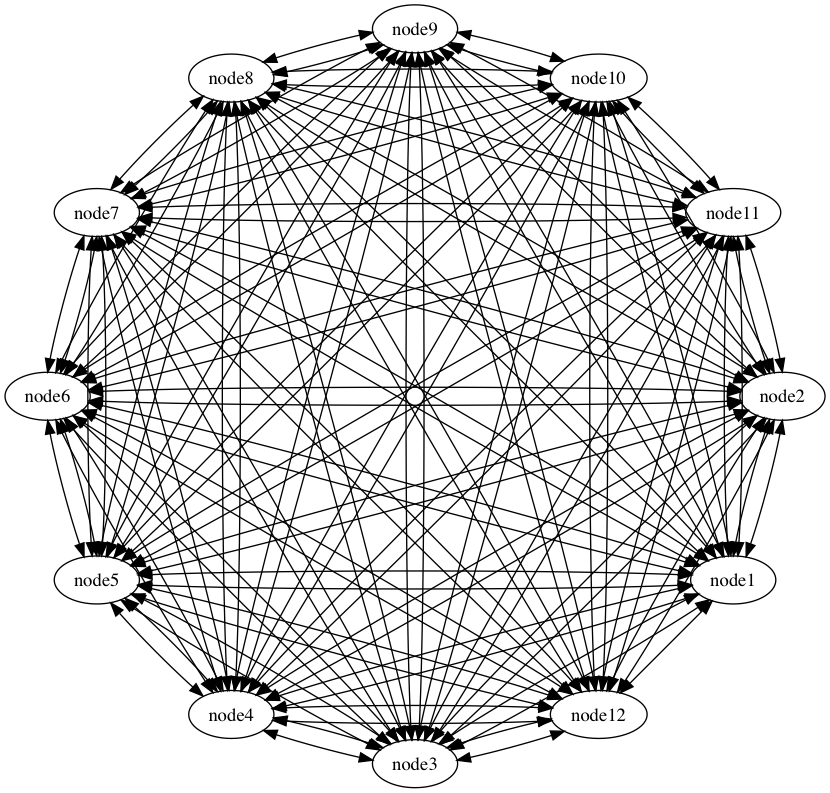

# 1. 网络结构

## 1.1. 网络整体

Bottos网络中的典型角色有三种：
- 终端用户
- 终端用户接入服务的提供者
- 超级节点（区块生产者）

&nbsp;

这三类角色将Bottos网络分成了三层，如下图所示。分别是
- 终端用户所在的接入层，这些终端用户有可能形成的终端网络
- 接入服务的提供者节点之间形成的服务层
- 超级节点之间组成的生产者网络

&nbsp;
&nbsp;


&nbsp;
&nbsp;
## 1.2. 超级节点网络

超级节点承担全网所有Transaction的执行和记录，是全网络稳定的基础，因此铂链在超级节点网络设计采用了全连接方式组网。如下图所示（以10个超级节点的全连接为例。实际的超级节点个数为49个，其中每轮选中29个出块，另外20个节点备选）



&nbsp;
&nbsp;

## 1.3. 其它节点与超级节点的连接图

除超级节点外的其它类型节点，是组织松散的网络，类似下图中的mesh结构的连接方式


&nbsp;
&nbsp;

# 2. 节点简介

Bottos节点分为基础服务节点、应用型节点、轻型节点、超轻型节点，各节点间彼此制衡和互补，形成动态平衡的节点自洽系统。

- **基础服务节点**
```
基础服务节点提供整个Bottos区块链系统的基础服务，除了支持区块链核心的交易共识、合约部署、区块生产等核心功能外，同时支持Bottos服务层提供的主体功能，如统一身份系统、存储管理服务、信用服务、Token管理以及合约管理等主要功能，为整体Bottos网络提供最主要的生产服务。
```

- **应用型节点**
```
应用型节点主要为生态系统中不同的DApps部署进行服务，应用型节点可以是自己部署，也可以部署在基础节点。（未来部署基础节点的逻辑App应用可以收取一定的部署门槛费用）。
```

- **轻型节点**
```
轻型节点主要作为Bottos的数据验证节点，不提供服务层相应的功能，仅进行区块数据同步等功能，可以支持Bottos核心层基本服务。
```

- **超轻型节点**
```
超轻型节点主要处理区块相关头验证，同步关键HASH数据等。
```